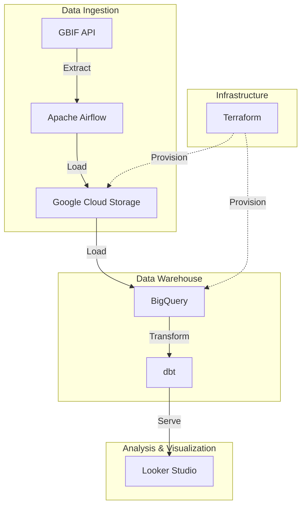

# 🐋 Whale BioMonitor: Global biodiversity tracking & conservation pipeline

## 📖 Problem Statement & Objective
Marine biodiversity is a critical indicator of our planet's ocean health. However, monitoring this biodiversity is notoriously difficult; raw data is often **disparate, messy, and voluminous**, originating from countless sources with inconsistent formats and varying quality.

I have developed **Global BioMonitor**  to solve this challenge by creating a specialized **Whale Tracker** pipeline. The project focuses on the order **Cetacea (whales, dolphins, and porpoises)**, providing an automated tool to ingest, clean, and standardize hundreds of thousands of global sightings. 

The primary goal is to answer: *What are the global spatial and seasonal distribution patterns of Cetaceans from 2021 to 2026?*

To achieve this, the pipeline:
1.  **Ingests** high-fidelity Cetacea occurrence data (Taxon Order 733).
2.  **Centralizes** these massive, disparate datasets into a scalable Data Warehouse.
3.  **Transforms and Optimizes** the records into a clean "Gold" layer for professional-grade geospatial analysis.

## 📊 Data Source: GBIF
The **Global Biodiversity Information Facility (GBIF)** is an international initiative that provides free and open access to biodiversity data globally. Established in 2001, it currently hosts over 1.9 billion occurrence records from thousands of data sources worldwide. GBIF's mission is to make scientific information about life on Earth accessible to everyone, everywhere.

### Citation
This dataset was collected through GBIF:
> GBIF.org (April 2026) GBIF Occurrence Download [https://doi.org/10.15468/dl.bz4kqh](https://doi.org/10.15468/dl.bz4kqh)

**Download Summary:**
*   **DOI:** [10.15468/dl.bz4kqh](https://doi.org/10.15468/dl.bz4kqh)
*   **Records Included:** 11,650,940 records from 5,029 datasets.
*   **Format:** Simple tab-separated values (TSV).
*   **Taxonomic Scope:** Mammalia (filtered for Cetacea in this project).

### 🛠️ Data Processing & Volume
While the source dataset provided by GBIF contains over **11 million** records for the class *Mammalia*, this pipeline specifically filters for the order **Cetacea** (whales, dolphins, and porpoises). After rigorous cleaning—removing records with missing coordinates, unidentified species, or invalid timestamps—the final **Whale Tracker** dataset consists of **346,154** high-fidelity sightings, ensuring the accuracy of the resulting spatial and seasonal analysis.

## 🏗️ Architecture
The pipeline follows standard data engineering best practices learned during the **Data Engineering Zoomcamp**:

## 🛠️ Tech Stack
- **Cloud:** Google Cloud Platform (GCP)
- **Infrastructure as Code:** Terraform
- **Workflow Orchestration:** Apache Airflow
- **Data Ingestion:** dlt (Data Load Tool) / Python
- **Data Lake:** Google Cloud Storage (GCS)
- **Data Warehouse:** BigQuery
- **Analytics Engineering:** dbt (data build tool)
- **Visualization:** Looker Studio 

## 📈 Dashboard Features
The final dashboard provides critical insights through four primary visualizations:
1. **Global Distribution Map:** A geospatial visualization identifying hotspots of cetacean activity across all oceans.
2. **Top Reported Species:** A ranking of the most frequently observed whales and dolphins.
3. **Seasonal Sighting Distribution:** Analyzing how biodiversity sightings shift across the four seasons.
4. **Conservation & Endangered Species:** An analysis of sighting volume categorized by IUCN risk levels.

👉 **[View the Live Dashboard Here](https://datastudio.google.com/s/vY97qzA18bk)**

## 🚀 How to Reproduce

### 0. Prerequisites
*   **GCP Account:** A Google Cloud project with BigQuery and GCS enabled.
*   **Credentials:** Export a Service Account key as JSON and name it `google_credentials.json` in the root directory.
*   **Environment:** Ensure you have `uv` installed for Python dependency management.

### 1. Execution Steps
1. **Infrastructure:** Navigate to `/terraform`, initialize with `terraform init` and run `terraform apply`. 
   *(Note: You may need to update the `project` variable in `variables.tf` to match your GCP Project ID).*
2. **Setup:** Install all dependencies using `uv sync`.
3. **Orchestration:** Start Airflow locally with `uv run airflow standalone`. Login to the UI and **trigger the `gbif_ingestion_dag`** to load the raw data into BigQuery.
4. **Transformation:** Navigate to `/dbt_transformation` and run `uv run dbt build`. This will load the IUCN seeds, run all models, and execute data quality tests.
5. **Dashboard:** Open Looker Studio and connect the `biomonitor_dbt.fct_biodiversity_sightings` table.

---
---
*This project was completed as part of the [Data Engineering Zoomcamp](https://github.com/DataTalksClub/data-engineering-zoomcamp).*

## 🔍 Technical Deep Dive & Project Evolution

### 1. Infrastructure (Terraform)
The project infrastructure was provisioned using **Terraform**, ensuring a reproducible and state-managed environment on GCP.
- **Resources:** One GCS bucket for the Data Lake and two BigQuery datasets (`biomonitor_raw` for ingestion and `biomonitor_dbt` for analytics).
- **Configuration:** All resources are provisioned in the `europe-west1` (EU) region to ensure data locality and optimized performance.

### 2. Research Focus & Dataset Refinement
Initially, the pipeline architecture was tested using the broad **Mammalia** class as a benchmark for high-volume ingestion. 
- **Strategic Refinement:** Once the infrastructure was validated, we refined the scope to our core research target: **Cetacea** (Order 733). By focusing on this specific group for the 2021-2026 period (~700k records), we ensured a much higher density of specific marine metadata, allowing for a more nuanced and impactful geospatial analysis.

### 3. Analytics Engineering (dbt)
The transformation layer was built using **dbt** to convert raw CSV dumps into structured, analytics-ready tables.

#### Staging Layer (`stg_gbif_occurrences`)
- **Schema Mapping:** Standardized inconsistent GBIF `SIMPLE_CSV` column names (e.g., `gbifid`, `decimallatitude`) to professional snake_case conventions (`gbif_id`, `latitude`).
- **Column Selection (The Core 18):**
    - **Identifiers:** `gbif_id`, `occurrence_id`.
    - **Taxonomy:** `species`, `scientific_name`, `kingdom`, `phylum`, `class`, `species_order`, `family`, `genus`, `taxon_rank`.
    - **Geospatial:** `latitude`, `longitude`, `country_code`, `locality`.
    - **Temporal:** `occurrence_timestamp`, `occurrence_year`, `occurrence_month`.
    - **Provenance:** `occurrence_status`, `basis_of_record`, `recorded_by`.
- **Data Typing:** Cast raw strings to appropriate formats: `FLOAT64` for coordinates, `TIMESTAMP` for event dates, and `INT64` for temporal components.
- **Data Cleaning:** Implemented strict quality filters, removing records with missing coordinates or species names to ensure dashboard accuracy.

#### Marts Layer (`fct_biodiversity_sightings`)
- **Enrichment:** Added an `occurrence_season` dimension (Winter, Spring, Summer, Autumn) based on the month to enable seasonal pattern analysis.
- **Deduplication:** Applied a `ROW_NUMBER()` window function partitioned by `gbif_id` to ensure unique sightings and prevent statistical inflation.
- **Optimization:** Implemented **Partitioning by Day** on `occurrence_timestamp` and **Clustering** by `species` and `country_code` to ensure dashboard queries are ultra-fast and cost-effective.

### 4. Scaling Up with Airflow & Architecture
The ingestion was scaled from manual scripts to a fully orchestrated **Airflow DAG**.
- **The "Bulk Download" Breakthrough:** We implemented the **GBIF Bulk Download API** to handle large-scale data preparation server-side. This architecture ensures high-fidelity data extraction and is the industry-standard for large-scale biodiversity research.
- **Resiliency:** The pipeline handles asynchronous polling for the download's `SUCCEEDED` status and manages local storage automatically.
- **Infrastructure Safety:** Implemented automated cleanup procedures to manage the 32GB disk limitations of the cloud environment.

### 5. Final End-to-End Workflow
The final pipeline operates as a coordinated **Hybrid Cloud** process:
1.  **Request (Cloud Source):** Airflow triggers a Bulk Download request on GBIF's cloud infrastructure.
2.  **Wait (Async Polling):** The DAG polls the API until the server-side ZIP preparation is complete.
3.  **Transfer (Bridge):** Airflow downloads the compressed ZIP to the local environment and streams it to **BigQuery** in 50k-record chunks using `dlt`.
4.  **Transform (Cloud Destination):** Once the raw data is in BigQuery, Airflow triggers `dbt build` to execute the transformation models.
5.  **Visualize:** The final fact table is consumed by **Looker Studio** for real-time biodiversity analysis.

