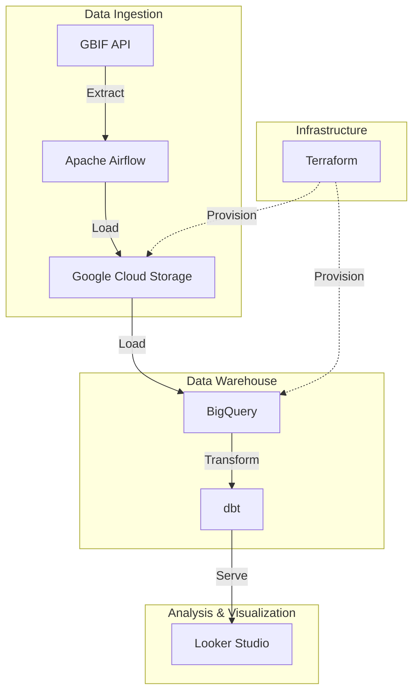

# 🌿 BioMonitor: Global Biodiversity Tracking & Conservation Pipeline

## 📖 Project Overview
BioMonitor is an end-to-end data pipeline designed to ingest, process, and visualize global species occurrence data. By leveraging the **GBIF (Global Biodiversity Information Facility) API**, this project tracks sightings of endangered and protected species across different temporal and geographical dimensions.

The goal of this project is to provide a robust framework for monitoring biodiversity trends, helping conservationists and researchers identify hotspots and decline patterns using modern data engineering tools.

## 🏗️ Architecture
The pipeline follows standard data engineering best practices learned during the **Data Engineering Zoomcamp**:

## 🛠️ Tech Stack
- **Cloud:** Google Cloud Platform (GCP)
- **Infrastructure as Code:** Terraform
- **Workflow Orchestration:** Apache Airflow
- **Data Ingestion:** dlt (Data Load Tool) / Python
- **Data Lake:** Google Cloud Storage (GCS)
- **Data Warehouse:** BigQuery
- **Analytics Engineering:** dbt (data build tool)
- **Visualization:** Looker Studio / Streamlit

## 📈 Dashboard Features
The final dashboard provides critical insights through:
1. **Species Distribution Map:** Identifying where biodiversity is thriving or under threat.
2. **Temporal Occurrence Trends:** Visualizing registration patterns over the last decades.
3. **Taxonomic Analysis:** Categorizing occurrences by class, order, and conservation status.

## 🚀 How to Reproduce
1. **Infrastructure:** Navigate to `/terraform` and run `terraform apply`.
2. **Orchestration:** Start Airflow using Docker Compose.
3. **Transformation:** Run `dbt build` to process the models in BigQuery.
4. **Dashboard:** Connect the BigQuery tables to Looker Studio.

---
*This project was completed as part of the [Data Engineering Zoomcamp](https://github.com/DataTalksClub/data-engineering-zoomcamp).*

