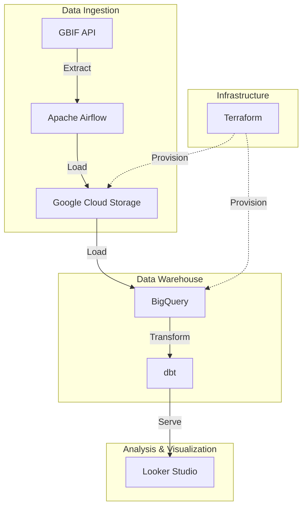

# 🌿 BioMonitor: Global Biodiversity Tracking & Conservation Pipeline

## 📖 Problem Statement & Objective
Marine biodiversity, specifically concerning **Cetaceans (whales, dolphins, and porpoises)**, is a critical indicator of ocean health. However, tracking these species globally is challenging due to the disparate nature of sighting reports and the massive volume of inconsistent metadata.

**Global BioMonitor** is designed to answer a specific research question: *What are the global spatial and seasonal distribution patterns of Cetaceans from 2021 to 2026?*

To achieve this, the pipeline:
1.  **Ingests** high-fidelity Cetacea occurrence data (Taxon Order 733).
2.  **Centralizes** the data into a scalable Data Warehouse.
3.  **Transforms and Optimizes** the records for professional-grade geospatial analysis.

## 🏗️ Architecture
The pipeline follows standard data engineering best practices learned during the **Data Engineering Zoomcamp**:

## 🛠️ Tech Stack
- **Cloud:** Google Cloud Platform (GCP)
- **Infrastructure as Code:** Terraform
- **Workflow Orchestration:** Apache Airflow
- **Data Ingestion:** dlt (Data Load Tool) / Python
- **Data Lake:** Google Cloud Storage (GCS)
- **Data Warehouse:** BigQuery
- **Analytics Engineering:** dbt (data build tool)
- **Visualization:** Looker Studio / Streamlit

## 📈 Dashboard Features
The final dashboard provides critical insights through:
1. **Species Distribution Map:** Identifying where biodiversity is thriving or under threat.
2. **Temporal Occurrence Trends:** Visualizing registration patterns over the last decades.
3. **Taxonomic Analysis:** Categorizing occurrences by class, order, and conservation status.

## 🚀 How to Reproduce
1. **Infrastructure:** Navigate to `/terraform` and run `terraform apply`.
2. **Orchestration:** Start Airflow using Docker Compose.
3. **Transformation:** Run `dbt build` to process the models in BigQuery.
4. **Dashboard:** Connect the BigQuery tables to Looker Studio.

---
---
*This project was completed as part of the [Data Engineering Zoomcamp](https://github.com/DataTalksClub/data-engineering-zoomcamp).*

## 🔍 Technical Deep Dive & Project Evolution

### 1. Infrastructure (Terraform)
The project infrastructure was provisioned using **Terraform**, ensuring a reproducible and state-managed environment on GCP.
- **Resources:** One GCS bucket for the Data Lake and two BigQuery datasets (`biomonitor_raw` for ingestion and `biomonitor_dbt` for analytics).
- **Configuration:** All resources are provisioned in the `europe-west1` (EU) region to ensure data locality and optimized performance.

### 2. Research Focus & Dataset Refinement
Initially, the pipeline architecture was tested using the broad **Mammalia** class as a benchmark for high-volume ingestion. 
- **Strategic Refinement:** Once the infrastructure was validated, we refined the scope to our core research target: **Cetacea** (Order 733). By focusing on this specific group for the 2021-2026 period (~700k records), we ensured a much higher density of specific marine metadata, allowing for a more nuanced and impactful geospatial analysis.

### 3. Analytics Engineering (dbt)
The transformation layer was built using **dbt** to convert raw CSV dumps into structured, analytics-ready tables.

#### Staging Layer (`stg_gbif_occurrences`)
- **Schema Mapping:** Standardized inconsistent GBIF `SIMPLE_CSV` column names (e.g., `gbifid`, `decimallatitude`) to professional snake_case conventions (`gbif_id`, `latitude`).
- **Column Selection (The Core 18):**
    - **Identifiers:** `gbif_id`, `occurrence_id`.
    - **Taxonomy:** `species`, `scientific_name`, `kingdom`, `phylum`, `class`, `species_order`, `family`, `genus`, `taxon_rank`.
    - **Geospatial:** `latitude`, `longitude`, `country_code`, `locality`.
    - **Temporal:** `occurrence_timestamp`, `occurrence_year`, `occurrence_month`.
    - **Provenance:** `occurrence_status`, `basis_of_record`, `recorded_by`.
- **Data Typing:** Cast raw strings to appropriate formats: `FLOAT64` for coordinates, `TIMESTAMP` for event dates, and `INT64` for temporal components.
- **Data Cleaning:** Implemented strict quality filters, removing records with missing coordinates or species names to ensure dashboard accuracy.

#### Marts Layer (`fct_biodiversity_sightings`)
- **Enrichment:** Added an `occurrence_season` dimension (Winter, Spring, Summer, Autumn) based on the month to enable seasonal pattern analysis.
- **Deduplication:** Applied a `ROW_NUMBER()` window function partitioned by `gbif_id` to ensure unique sightings and prevent statistical inflation.
- **Optimization:** Implemented **Partitioning by Day** on `occurrence_timestamp` and **Clustering** by `species` and `country_code` to ensure dashboard queries are ultra-fast and cost-effective.

### 4. Scaling Up with Airflow & Architecture
The ingestion was scaled from manual scripts to a fully orchestrated **Airflow DAG**.
- **The "Bulk Download" Breakthrough:** We implemented the **GBIF Bulk Download API** to handle large-scale data preparation server-side. This architecture ensures high-fidelity data extraction and is the industry-standard for large-scale biodiversity research.
- **Resiliency:** The pipeline handles asynchronous polling for the download's `SUCCEEDED` status and manages local storage automatically.
- **Infrastructure Safety:** Implemented automated cleanup procedures to manage the 32GB disk limitations of the cloud environment.

### 5. Final End-to-End Workflow
The final pipeline operates as a coordinated **Hybrid Cloud** process:
1.  **Request (Cloud Source):** Airflow triggers a Bulk Download request on GBIF's cloud infrastructure.
2.  **Wait (Async Polling):** The DAG polls the API until the server-side ZIP preparation is complete.
3.  **Transfer (Bridge):** Airflow downloads the compressed ZIP to the local environment and streams it to **BigQuery** in 50k-record chunks using `dlt`.
4.  **Transform (Cloud Destination):** Once the raw data is in BigQuery, Airflow triggers `dbt build` to execute the transformation models.
5.  **Visualize:** The final fact table is consumed by **Looker Studio** for real-time biodiversity analysis.

